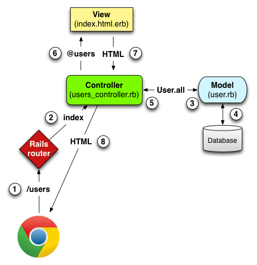

# Rails

https://rubyonrails.org/


Reference repo - https://github.com/munderseth/my.rails

To create an example app:
```
rails new .
```

Options:
- `-T` - no tests
- `-d mysql` - use MySQL


To force a reinstall of all gems:
```
bundle install --force
```
## Development

### Terms

- CRUD - Create, Read, Update, Destore
- MVC - Model (db), View (pages), Controller (logic)
- erb - Embedded Ruby (template code within html)
- Capybara (ca.pa.bar.a) -

### MVC
The model-view-controller (MVC) pattern



### CRUD
Web applications involve CRUD -  `Create`, `Read`, `Update`, and `Delete` - operations. Rails uses the term **resource** to represent a collection of routes, along with controller actions and views that perform CRUD on a database model (i.e. data).

A method called `resource` that creates conventional routes and helper methods.

Example for an `Article` model:
```
Prefix Verb   URI Pattern                  Controller#Action
        root GET    /                            articles#index
    articles GET    /articles(.:format)          articles#index
 new_article GET    /articles/new(.:format)      articles#new
     article GET    /articles/:id(.:format)      articles#show
             POST   /articles(.:format)          articles#create
edit_article GET    /articles/:id/edit(.:format) articles#edit
             PATCH  /articles/:id(.:format)      articles#update
             DELETE /articles/:id(.:format)      articles#destroy
```

In addition, `article_path` and `article_url` are created.

Notes:
- **Validations** are rules that are checked before a `model` object is saved.

### Database

Drop:
```
bundle exec rake db:drop
```
Create:
```
bundle exec rake db:create db:migrate
```

### Commands

- `rails console`
- `rails routes --expanded` - list all of the routes (refer [here](https://www.bigbinary.com/blog/rails-5-options-for-rake-routes))
- `rails generate rspec:install` - setup rspec within project
- `irb` - ruby interpreter
- `gem which <name>` - shows gem location
- `whereis <bin>` - linux command to show location
- Add to log file - `logger.debug "This is a debug message"`

#### Debugging

```
logger.debug "DEBUG: #{__method__}, #{__FILE__}:#{__LINE__}"
```

## Testing

### Setup

1. Update `Gemfile`
    ```
    gem "rspec-rails"
    gem "capybara"
    gem "selenium-webdriver"
    gem "factory_bot_rails"
    gem "database_cleaner"
    ```
2. Bundle install
3. Create `spec/support/factory_bot.rb`
   ```
   RSpec.configure do |config|
       config.include FactoryBot::Syntax::Methods
   end
   ```
4. Uncomment "Dir[Rails.root.join].." in `spec/rails_helper.rb`


#### References

- https://github.com/thoughtbot/factory_bot/blob/master/GETTING_STARTED.md
- https://semaphoreci.com/community/tutorials/working-effectively-with-data-factories-using-factorygirl
- https://thoughtbot.com/blog/automatically-wait-for-ajax-with-capybara
- https://github.com/teamcapybara/capybara#asynchronous-javascript-ajax-and-friends


## Codespaces
There are some specific to work in Codespaces.

Requires to install rails:
```
gem install rails
```

In the controllers required to add the following before a **POST** (Create):
```
skip_before_action :verify_authenticity_token
```
Otherwise will not write to the database. Refer to [stackoverflow question](https://stackoverflow.com/questions/65688157/why-is-my-http-origin-header-not-matching-request-base-url-and-how-to-fix) for more details.

## References

- https://www.learnenough.com/ruby-on-rails-7th-edition-tutorial by Michael Hartl
- [Intro Videos for Codemy.com](https://www.classcentral.com/classroom/freecodecamp-learn-ruby-on-rails-full-course-57811) from Jonh Elder
- https://www.theodinproject.com/paths/full-stack-ruby-on-rails/courses/ruby-on-rails
